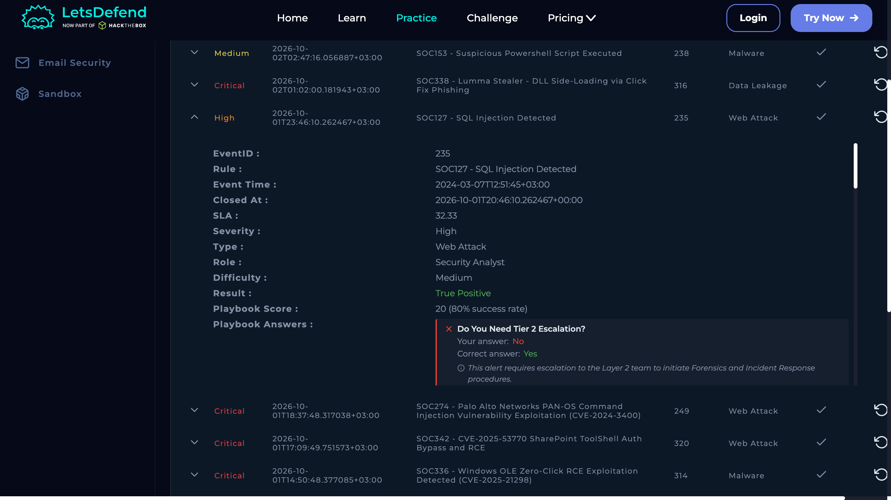
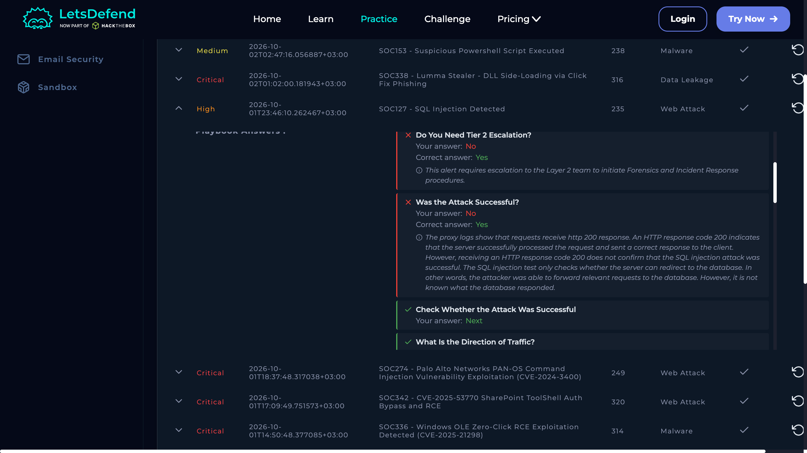

# SOC127 — SQL Injection Detected

**Severity:** High  
**Type:** Web Attack  
**Result:** True Positive  
**Host:** WebServer1000 (172.16.20.12)  
**Source:** 118.194.247.28  
**Event ID:** 235  
**Risk:** 15/25 — High

## 1. What Happened

An attacker from the internet sent multiple SQL injection requests against WebServer1000. The activity was consistent with an automated SQL injection scan using **sqlmap**.

The available evidence did not confirm successful data extraction or server compromise. However, the requests were processed and the LetsDefend investigation treated the alert as requiring further investigation and Tier 2 escalation.

## 2. Evidence
### Investigation Details

### Investigation Results

### Supporting Evidence
### Supporting Evidence

- Source IP: `118.194.247.28`
- User-Agent identified as **sqlmap 1.7.2**.
- Multiple SQL injection requests were observed.
- Requests included SQL injection and other potentially dangerous payloads.
- HTTP responses returned status **200**.
- The source IP had significant abuse reports and malicious detections.
- No suspicious endpoint process activity was identified.
- Available evidence did not confirm successful extraction or host access.

## 3. MITRE ATT&CK

- **T1595.002** — Vulnerability Scanning
- **T1190** — Exploit Public-Facing Application

## 4. Actions

- Escalate to Tier 2 for further investigation.
- Block or rate-limit the malicious source where appropriate.
- Review WAF and web-server logs for additional SQL injection attempts.
- Validate application input handling and use parameterized queries.
- Monitor for database access or abnormal application behavior.

## Final Verdict

**True Positive — malicious SQL injection activity; successful compromise was not confirmed.**
