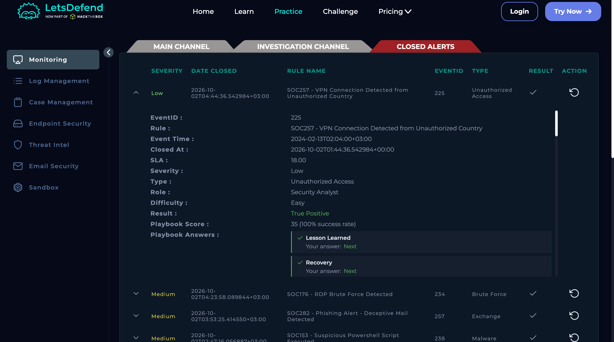
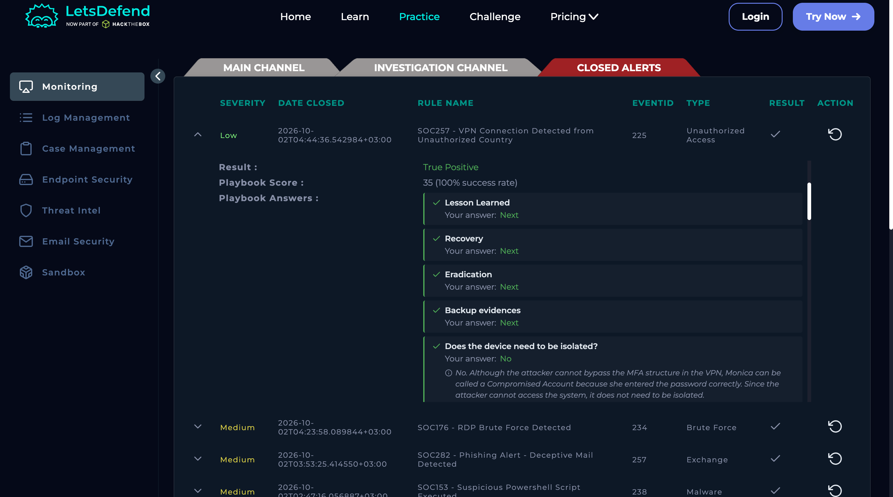

# SOC257 — VPN Connection Detected from Unauthorized Country

**Severity:** Low  
**Type:** Unauthorized Access  
**Result:** True Positive  
**Account:** Monica  
**Source:** 113.161.158.12  
**Destination:** VPN Gateway (33.33.33.33)  
**Event ID:** 225

## 1. What Happened

An external source from Vietnam attempted to access the VPN using Monica's credentials at approximately 02:02.

The correct password was entered, but the attacker supplied an incorrect MFA one-time password. The login therefore did not result in a VPN session.

## 2. Evidence
### Investigation Details

### Investigation Results

### Supporting Evidence

- Source IP: `113.161.158.12`
- VPN login attempt was observed.
- The password was accepted.
- MFA response showed **Incorrect OTP Code**.
- No VPN session was established.
- Threat Intelligence identified the source with brute-force related indicators.
- No corresponding suspicious activity was found on Monica's endpoint.

## 3. MITRE ATT&CK

- **T1595** — Active Scanning
- **T1133** — External Remote Services
- **T1078** — Valid Accounts
- **T1621** — Multi-Factor Authentication Request Generation

## 4. Actions

- No endpoint isolation was required because the VPN login was blocked by MFA.
- Reset Monica's password.
- Block the malicious source IP.
- Confirm whether Monica received unexpected MFA prompts.
- Check for password reuse or credential exposure.

## Final Verdict

**True Positive — malicious access attempt blocked by MFA; no successful VPN session was observed.**
