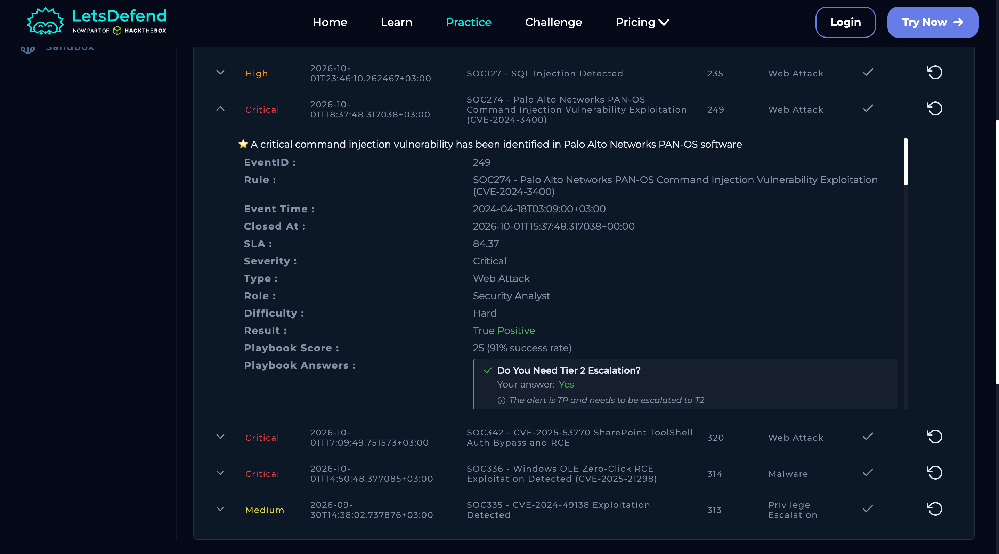
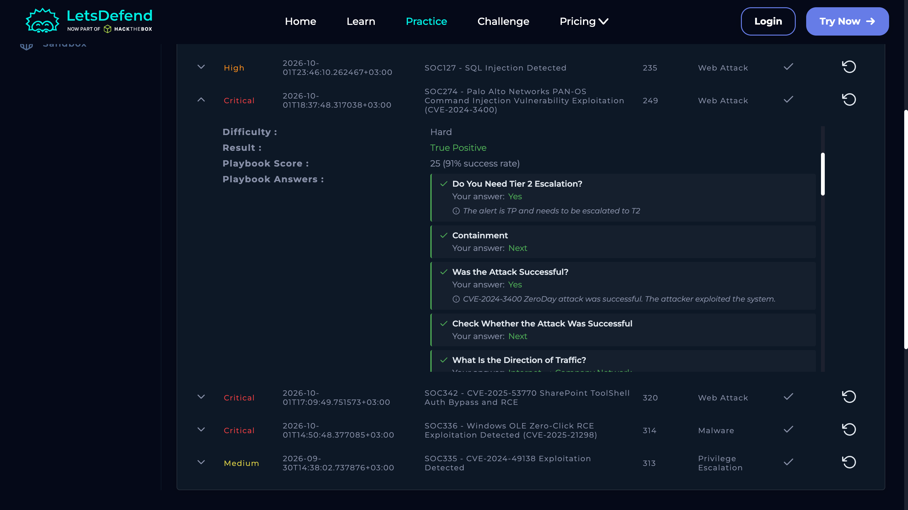

# SOC274 — Palo Alto PAN-OS Command Injection

**Severity:** Critical  
**Type:** Web Attack  
**Result:** True Positive  
**Host:** PA-Firewall-01 (172.16.17.139)  
**Source:** 144.172.79.92  
**Event ID:** 249  
**Risk:** 25/25 — Critical

## 1. What Happened

An attacker from the internet targeted a Palo Alto PAN-OS GlobalProtect service using **CVE-2024-3400**.

The malicious request contained path traversal and shell-command injection data. The investigation showed that the injected command was processed by the firewall with root-level execution.

## 2. Evidence
### Investigation Details

### Investigation Results

### Supporting Evidence
### Supporting Evidence

- Source IP: `144.172.79.92`
- Target endpoint: `/global-protect/login.esp`
- Malicious cookie contained path traversal and command-injection content.
- HTTP response was **200**.
- Telemetry showed the malicious value being passed into a command executed by the system.
- The command executed with root privileges.
- The firewall connected back to the attacker infrastructure.
- Threat Intelligence identified the source as malicious.
- LetsDefend confirmed the attack was successful.

## 3. MITRE ATT&CK

- **T1190** — Exploit Public-Facing Application
- **T1059.004** — Unix Shell
- **T1033** — System Owner/User Discovery
- **T1071.001** — Web Protocols

## 4. Actions

- Contain the firewall and escalate to Tier 2.
- Block `144.172.79.92`.
- Disable internet-facing GlobalProtect until patched if operationally possible.
- Check for persistence and unauthorized configuration changes.
- Rotate relevant firewall credentials, passwords and keys where required.
- Hunt other network devices for the same indicators.

## Final Verdict

**True Positive — successful command injection was observed.**
