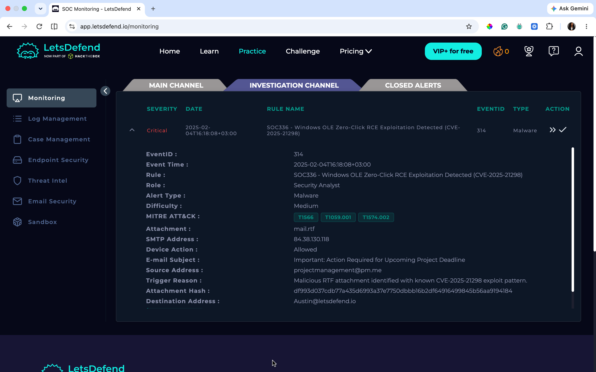
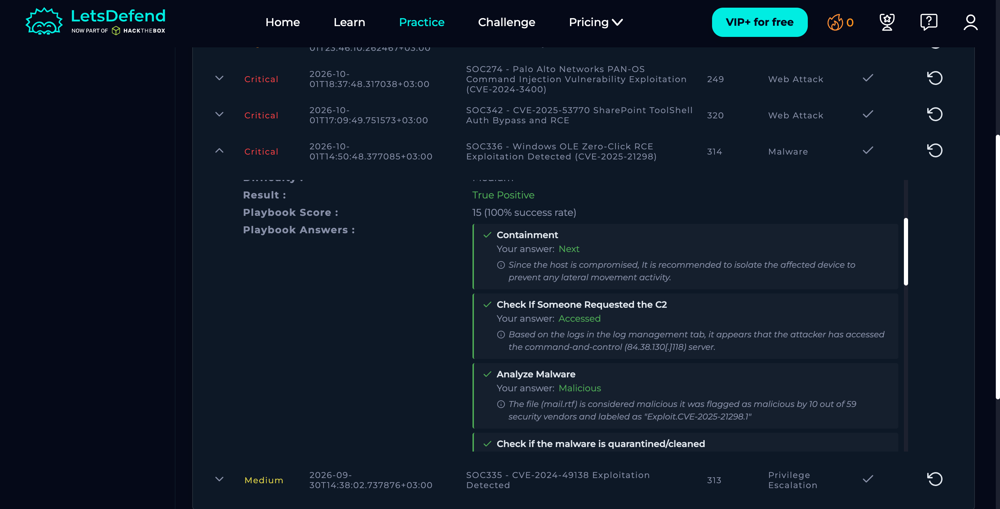

# SOC336 — Windows OLE Zero-Click RCE

**Severity:** Critical  
**Type:** Malware  
**Result:** True Positive  
**Host:** Austin (172.16.17.137)  
**Source:** 84.38.130.118  
**Event ID:** 314  
**Risk:** 25/25 — Critical

## 1. What Happened

Austin received a phishing email containing a malicious RTF attachment named `mail.rtf`. The attachment was associated with **CVE-2025-21298**, a Windows OLE remote code execution vulnerability.

The investigation showed Outlook starting `cmd.exe`, followed by `regsvr32.exe` being used to retrieve and execute attacker-controlled code. The endpoint also connected to the attacker infrastructure.

## 2. Evidence
### Investigation Details

### Investigation Results

### Supporting Evidence

- Sender: `projectmanagement@pm.me`
- Subject: **Important: Action Required for Upcoming Project Deadline**
- Source IP: `84.38.130.118`
- Attachment: `mail.rtf`
- VirusTotal showed **28/61** vendors flagging the attachment as malicious.
- Threat Intelligence associated the attachment with **CVE-2025-21298**.
- Outlook spawned `cmd.exe`.
- `regsvr32.exe` was used to retrieve attacker-controlled code.
- Austin connected to `84.38.130.118:80`.
- The malicious activity was not quarantined.

## 3. MITRE ATT&CK

- **T1566.001** — Phishing: Spearphishing Attachment
- **T1203** — Exploitation for Client Execution
- **T1059.003** — Windows Command Shell
- **T1218.010** — Regsvr32
- **T1071.001** — Web Protocols

## 4. Actions

- Contain Austin.
- Remove the malicious email and attachment.
- Block the source IP and malicious URL.
- Reset affected credentials.
- Apply the relevant Windows security update.
- Hunt for the attachment hash, source IP and suspicious Regsvr32 execution.

## Final Verdict

**True Positive — successful malicious execution and outbound communication were observed.**
