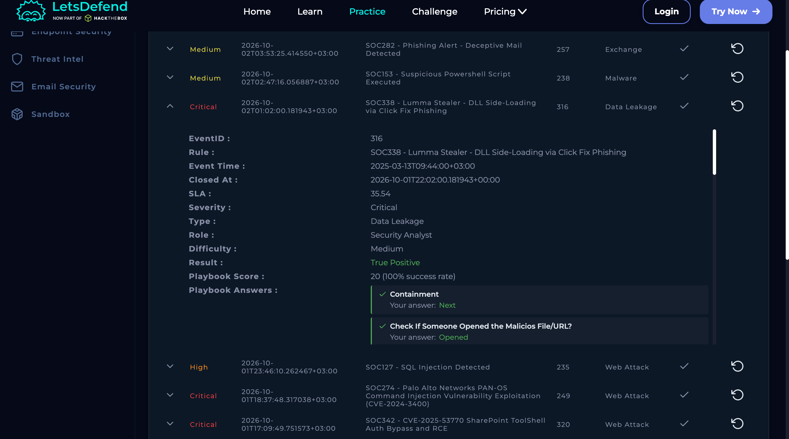
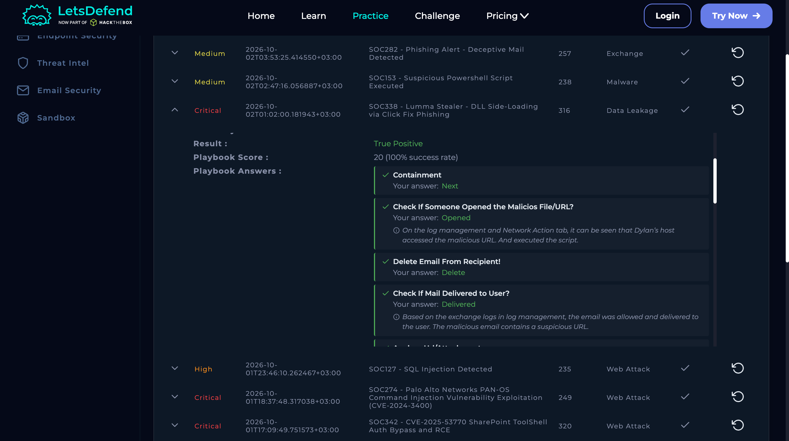

# SOC338 — Lumma Stealer via ClickFix Phishing

**Severity:** Critical  
**Type:** Data Leakage  
**Result:** True Positive  
**Host:** Dylan  
**Source:** 132.232.40.201  
**Event ID:** 316  
**Risk:** 25/25 — Critical

## 1. What Happened

Dylan received a phishing email using fake Windows update branding. The user was directed to a malicious website and shown ClickFix-style instructions that encouraged the user to execute commands.

The investigation showed PowerShell and `mshta.exe` activity downloading an HTA/script payload associated with **Lumma Stealer**.

## 2. Evidence
### Investigation Details

### Investigation Results

### Supporting Evidence

- Phishing domain: `windows-update.site`
- Subject promoted a free Windows 11 Pro upgrade.
- Dylan visited the malicious website.
- PowerShell launched `mshta.exe`.
- `mshta.exe` accessed a remote payload from `overcoatpassably.shop`.
- Proxy evidence showed the payload being downloaded.
- Threat Intelligence associated the activity with Lumma.
- VirusTotal showed malicious detections for the domain and URL.

Lumma Stealer is an information-stealing malware associated with theft of credentials, browser data and other sensitive information.

## 3. MITRE ATT&CK

- **T1566.002** — Phishing: Spearphishing Link
- **T1204.004** — User Execution: Malicious Copy and Paste
- **T1059.001** — PowerShell
- **T1027** — Obfuscated Files or Information
- **T1218.005** — Mshta
- **T1105** — Ingress Tool Transfer
- **T1574.002** — DLL Side-Loading

## 4. Actions

- Contain Dylan's endpoint.
- Escalate to Tier 2.
- Remove the phishing email.
- Block the malicious domains and IP addresses.
- Reset potentially exposed credentials and terminate active sessions.
- Hunt for the same indicators across endpoints.
- Reinforce user awareness around ClickFix-style attacks.

## Final Verdict

**True Positive — malicious phishing and malware execution activity observed.**
