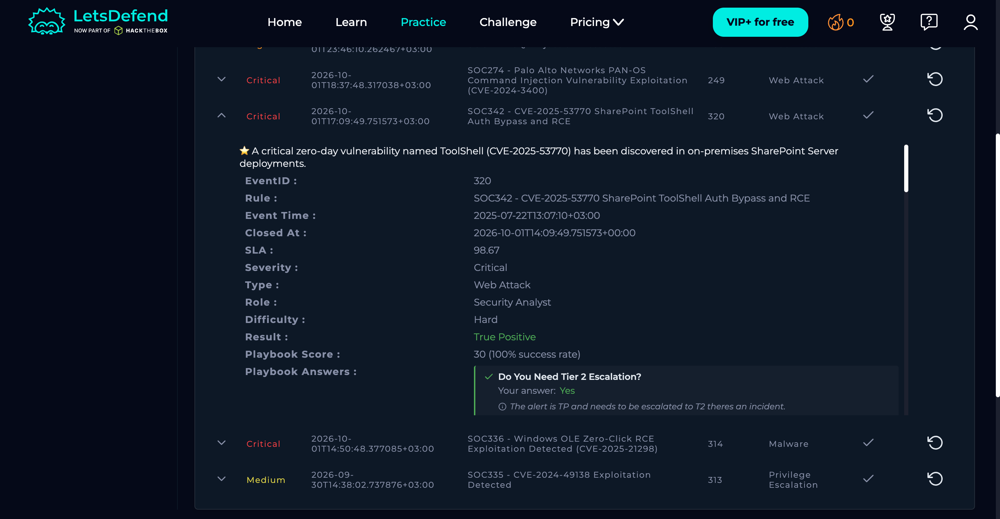
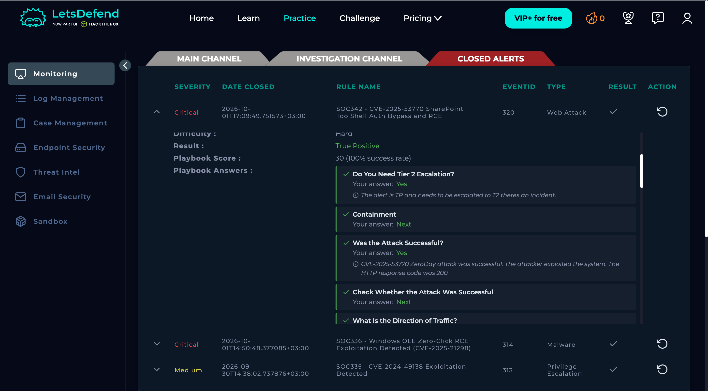

# SOC342 — SharePoint ToolShell Authentication Bypass and RCE

**Severity:** Critical  
**Type:** Web Attack  
**Result:** True Positive  
**Host:** SharePoint01 (172.16.20.17)  
**Source:** 107.191.58.76  
**Event ID:** 320  
**Risk:** 25/25 — Critical

## 1. What Happened

An internet-based attacker targeted SharePoint using the **CVE-2025-53770 ToolShell** vulnerability. The request targeted `/_layouts/15/ToolPane.aspx` and was followed by server-side process execution and creation of a web shell.

The LetsDefend playbook confirmed that the attack was successful and required Tier 2 escalation.

## 2. Evidence
### Investigation Details

### Investigation Results

### Supporting Evidence

- Source IP: `107.191.58.76`
- POST request targeted the SharePoint ToolPane endpoint.
- `w3wp.exe` spawned PowerShell.
- `csc.exe` was used to compile a payload.
- `cmd.exe` wrote `spinstall0.aspx`, a web shell, into the SharePoint LAYOUTS directory.
- PowerShell accessed SharePoint MachineKey configuration.
- SharePoint01 connected back to the attacker IP.
- Threat Intelligence tagged the IP with **CVE-2025-53770**.
- LetsDefend recorded the HTTP response as successful.

## 3. MITRE ATT&CK

- **T1190** — Exploit Public-Facing Application
- **T1059.001** — PowerShell
- **T1505.003** — Web Shell
- **T1552** — Unsecured Credentials
- **T1071.001** — Web Protocols

## 4. Actions

- Contain SharePoint01 and escalate to Tier 2.
- Block `107.191.58.76`.
- Remove the web shell and malicious payload.
- Review and rotate potentially exposed secrets/keys.
- Patch the SharePoint vulnerability.
- Hunt other SharePoint systems for the same indicators and web shell.

## Final Verdict

**True Positive — successful exploitation with web-shell execution and outbound communication.**
